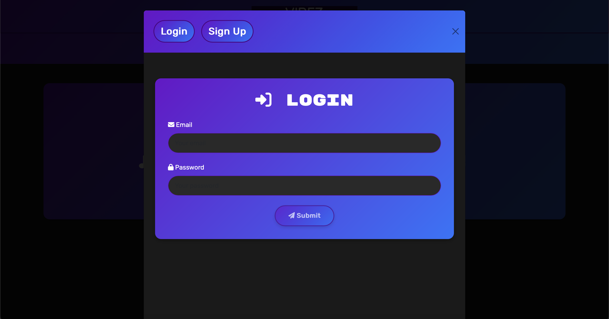
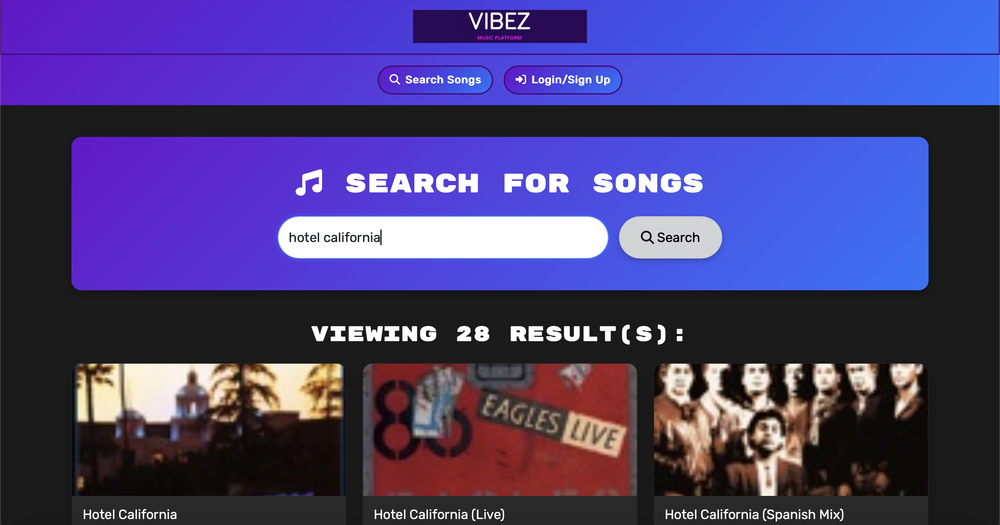
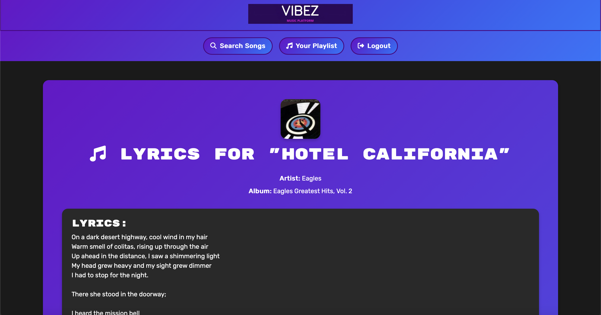

# Vibez Tune Music App

## Table of Contents

1. [Overview](#overview)
2. [Demo](#demo)
3. [Concepts Covered](#concepts-covered)
4. [Learning Objectives](#learning-objectives)
5. [Technologies Used](#technologies-used)
6. [Features](#features)
7. [Setup and Installation](#setup-and-installation)
   - [Prerequisites](#prerequisites)
   - [Steps to Run Locally](#steps-to-run-locally)
8. [Summary](#summary)

## Overview

The **Vibez Tune Music App** is a refactored application that allows users to search for songs, view lyrics, and save their favorite tracks. Built with the **MERN stack**—MongoDB, Express.js, React, and Node.js—this app showcases seamless integration with the **Lyrics.ovh API** for fetching song lyrics. Users can create accounts, log in, and manage their personal song library.

The application is deployed using **Render** with a **MongoDB Atlas** database, ensuring scalability and accessibility.

## Demo






[Live Demo](https://vibez-tune-music-app.onrender.com)

## Concepts Covered

- **GraphQL Integration**:

  - Implemented a GraphQL API for efficient data fetching and management.
  - Developed queries and mutations to handle user authentication and song operations.

- **Apollo Client and Server**:

  - Used Apollo Server for managing GraphQL schemas, resolvers, and middleware.
  - Integrated Apollo Client into the React frontend for executing GraphQL queries and mutations.

- **Authentication Middleware**:

  - Securely integrated authentication using JWT in the GraphQL context.

- **Lyrics.ovh API Integration**:

  - Utilized the Lyrics.ovh API to fetch lyrics dynamically based on user search inputs.

- **Deployment**:

  - Deployed the application to Render with a MongoDB Atlas database.

## Learning Objectives

- Understand how to implement GraphQL using Apollo Server in a MERN application.
- Learn how to secure APIs using JWT-based authentication.
- Manage state and data using Apollo Client in React.
- Deploy a full-stack application with a NoSQL database to a cloud platform.

## Technologies Used

- **MongoDB**: NoSQL database for storing user and song data.
- **Express.js**: Web framework for building the server and managing routes.
- **React**: Frontend library for building the user interface.
- **Node.js**: JavaScript runtime for server-side logic.
- **GraphQL**: API query language for efficient data retrieval and mutation.
- **Apollo Server**: GraphQL server for managing schema and resolvers.
- **Apollo Client**: Client-side library for executing GraphQL queries and mutations.
- **JWT**: JSON Web Token for user authentication and session management.
- **Render**: Cloud platform for deploying the application.
- **Lyrics.ovh API**: External API for fetching song lyrics.

## Features

- **GraphQL Integration**: Efficiently fetch and mutate data using queries and mutations.
- **Search Functionality**: Search for songs by artist and title.
- **Lyrics Display**: Fetch and display song lyrics dynamically.
- **User Authentication**: Securely create accounts, log in, and manage user sessions.
- **Save Songs**: Save songs to a personalized library for future reference.
- **Remove Songs**: Remove songs from the saved list.
- **Responsive Design**: Mobile-friendly design for seamless access on all devices.

## Setup and Installation

### Prerequisites

- Node.js (v14 or later)
- MongoDB Atlas account
- npm (Node package manager)

### Steps to Run Locally

1. Install server dependencies:

   ```bash
   cd server
   npm install
   ```

2. Install client dependencies:

   ```bash
   cd ../client
   npm install
   ```

3. Set up a `.env` file in the `server` directory:

   ```plaintext
   MONGODB_URI=your_mongodb_atlas_uri
   JWT_SECRET=your_jwt_secret
   PORT=3001
   ```

4. Run the application locally:

   ```bash
   npm run develop
   ```

5. Open your browser and navigate to `http://localhost:3000`.

## Summary

The **Vibez Tune Music App** provides an engaging and interactive platform for users to explore music, view lyrics, and create a personalized song library. With its GraphQL-powered backend and seamless frontend experience, the app showcases the power of the MERN stack. The integration of the Lyrics.ovh API ensures real-time lyric fetching, while deployment on Render guarantees reliability and scalability.

Start vibing to your favorite tunes with the **Vibez Tune Music App** today!
